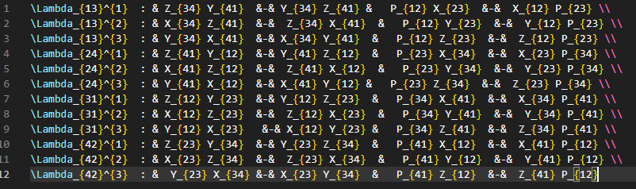
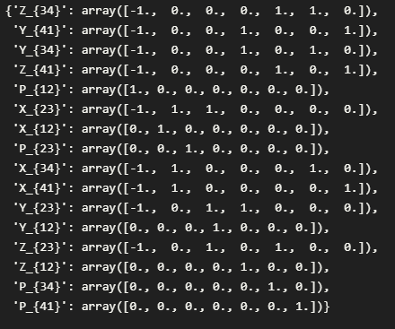

# Forward Algorithm
So far the algorithm can take the J and E terms in this format (this was taken from the latex source of the polytopes paper):

And arrive at the K matrix using brute force. However as a test used the labeling found in the reference and arrived at the same K matrix as a test.

----
## References ##
[[1] https://arxiv.org/pdf/1506.03818.pdf](https://arxiv.org/pdf/1506.03818.pdf)

