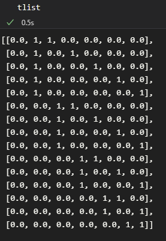

# Forward Algorithm

So far the code can generate the K matrix using brute force. I used model 1 or C^4/Z_4 q{1,1,1,1} to test it. It does it from the J and E terms as initial data in the following format:

**Initial Data**

this is in latex which was taken directly from the source of the polytopes paper. For this kmatrix I used the labeling found in the paper just to test the code.

**K matrix:**

With the T matrix I am having an issue. Im looking for a set of vectors that will give me a >=0 inner product with the vectors in the K matrix but I'm finding 15 instead of the 8 mentioned in the example of the forward algorithm.

**T matrix:**

----
## References ##
[[1] https://arxiv.org/pdf/1506.03818.pdf](https://arxiv.org/pdf/1506.03818.pdf)

